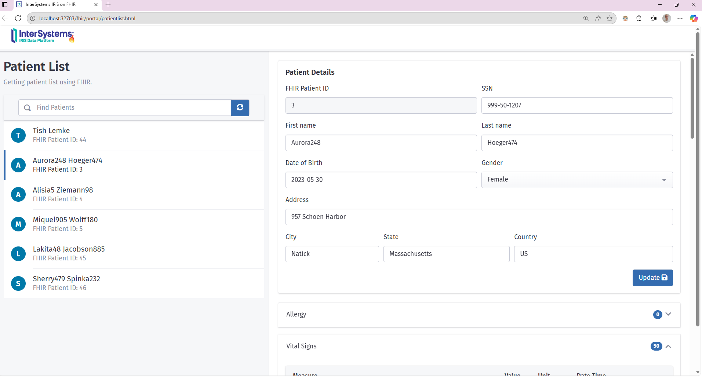

# Setting Up the Environment

In this tutorial, we will be using an instance of IRIS-health with a FHIR server, from within a docker container. There are lots of good tutorials on how to use [IRIS-community editions with docker](https://community.intersystems.com/post/running-intersystems-iris-docker-step-step-guide-part-1-basics-custom-dockerfile), but for now I am going to use a pre-loaded build. This repository includes a docker template forked from [IRIS-health + FHIR docker starter repo](https://github.com/pjamiesointersystems/Dockerfhir/tree/main). The template supplied here has minor changes (different ports published), but are functionally the same. 

If you would rather set up a FHIR server from scratch with a clean edition of IRIS-health-community, there is a tutorial to [Create a FHIR Server in 5 minutes](../Additional-demos/CreateAFHIRServerIn5Minutes.md).

###  Clone repo
To start, clone this repository: 

	git clone https://github.com/intersystems-community/FHIR-AI-Hackathon-Kit

Then enter FHIR-AI-Hackathon-Kit/Dockerfhir:

	cd FHIR-AI-Hackathon-Kit/Dockerfhir

### Run IRIS for Health Community with docker-compose

**For the next step you need to have [docker](https://www.docker.com/products/docker-desktop/) installed and running on your system.**

Run: 

```
docker pull intersystemsdc/irishealth-community:latest
```

to download the container, and 

```
docker-compose build
```

to build the deployment. These two steps will take a while to run. But then you can start up the container with: 

```
docker-compose up -d 
```
the -d flag makes it run in the background. 

## Access the IRIS Management Portal

Once the container is started, open your browser and go to:
 **[http://localhost:32783/csp/sys/UtilHome.csp](http://localhost:32783/csp/sys/UtilHome.csp)**  


**Login Credentials:**
- **Username:** `_SYSTEM`
- **Password:** `ISCDEMO`

Note, sometimes it takes a minute for the management portal to come online here, so if nothing appears at the link above, wait a couple of minutes, then refresh the page. 

## Explore the FHIR server
 
The FHIR server should now be available at http://localhost:32783/csp/healthshare/demo/fhir/r4, although you won't see anything at this base-URL. To test that the server is online, you can go to http://localhost:32783/csp/healthshare/demo/fhir/r4/metadata. This should automatically download a file (metadata.json) containing metadata about the FHIR server. 

You can also explore the FHIR data at a user interface at: 

http://localhost:32783/fhir/portal/patientlist.html



This interface is provided by the [iris-fhir-portal](https://openexchange.intersystems.com/package/iris-fhir-portal?tab=details) package which has been pre-loaded. All credit to the package author, Henrique Dias.

You can also explore and test the FHIR server using Swagger-UI, which provides a user interface to the FHIR HTTP specification. This can be found at http://localhost:32783/swagger-ui/index.html. 

## Creating Python Environment

The remainder of the tutorial is included in Jupyter Notebooks, connecting to the InterSystems IRIS for Health and the FHIR server from client-side Python code. 

Before continuing, its a good idea to create a clean Python environment. This is made easier by Python package managers (e.g. Conda or UV), but will be shown using Python's built in `venv` function. `venv` will create an environment directory within the current directory. The code below will show the creation of a new environment in the `Tutorial` directory. This assumes you are contining with the terminal shell currently in Dockerfhir:

```shell

cd ../Tutorial
python -m venv my-iris-env
```
Activating the environment depends on your operating system:
Windows: 
```
.\my-iris-env\Scripts\activate
```
Mac/Linux: 
```
source my-iris-env/bin/activate
```

### Installing Dependencies

All Python dependencies will be installed when they are required or first introduced, but to perform a single install, you can also use:

```
pip install -r ../requirements.txt
```

For installing on the fly, we need to begin by installing Jupyter Notebook. This allows us to run an interactive Python document where blocks of code can be run, with variables saved in a global context. 

```
pip install jupyter notebook
```

## Optional: Accessing IRIS for Health Terminal 

**This is not required at any point in this tutorial**, but is added here for  reference.

You may want to access the terminal within your instance of InterSystems IRIS for Health, particularly if you want to run server-side code, or copy data into your IRIS instance. 

- **To access an IRIS terminal**, navigate to `FHIR-AI-Hackathon-Kit/Dockerfhir` and run:

	```
	docker-compose exec -it iris-fhir iris session iris
	```
	You can then run ObjectScript:
	```
	USER> write "Hello World"
	Hello World
	```
	To exit the IRIS terminal, run `halt`.

- To access a standard bash terminal, you can use: 
	```
	docker-compose exec -it iris-fhir bash
	```
	
	Exit with `exit`
 
- To copy local files into the InterSystems IRIS for Health docker instance use `docker-compose cp`
	```
	docker-compose cp /path/to/file iris-fhir:/path/in/container
	```

## Next Steps

Now you have installed the FHIR server you can continue with the main tutorial with [1-Using-FHIR-SQL-builder](1-Using-FHIR-SQL-Builder.ipynb), or check out the additional demos on [Accessing FHIR Resources](../Additional-demos/Accessing-FHIR-resources.ipynb), 
[Adding FHIR Data](../Additional-demos\Adding-FHIR-data-to-IRIS-health.ipynb) and [making synthetic FHIR data](../Additional-demos/Making-synthetic-fhir-data.md).

To continue with the tutorial from within a runnign Jupyter Notebook, as intended, run 

```
jupyter notebook 1-Using-FHIR-SQL-builder.ipynb
```

